# Market-Segmentation-on-McDonalds
The below shown is the Mc Donalds dataset which has the feedback collected from 1453 cutomers on various factors.
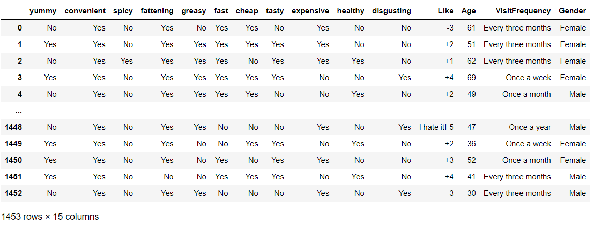

The below shown is the Principal Component Analysis of all the 11 categories and their
corresponding standard deviation,proportion of variance and cummulative proportion. These Principal Component are calculated so that these resulting components can be rotated to project the data for analysis.
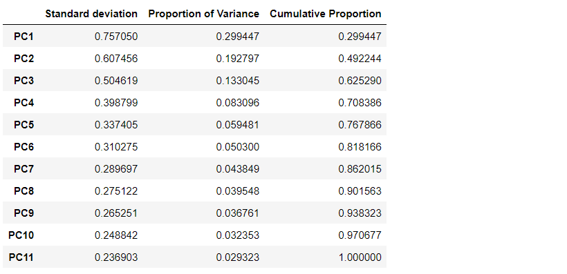

Rotate the Principal component what ever were computed earlier.
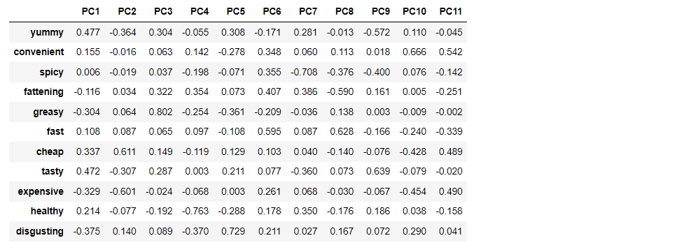

Now, project the data into the principal component space.The below shown figure is the projection of the two principal components PC1 and PC2
on all the different categories
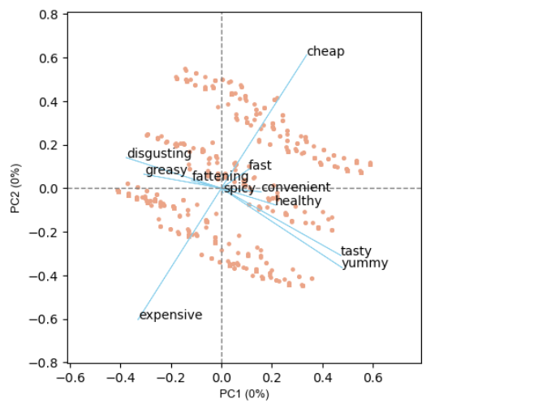

After applying k-means for the extraction of the segments(basically to calculate 2-8 market segments), we end up getting the following plot in which it is difficult to figure out the optimal value of k as their is no sign of elbow joint.
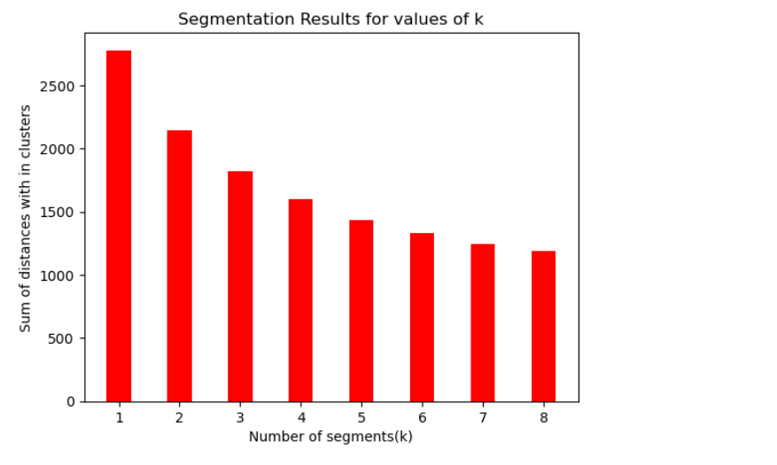

Here, Bootstrap Flexclust Algorithms are used to check the possibility of figuring out
the values of k which is done by forming different number of clusters repeatedly on the 
original data and it returns the RAND index, centroids.
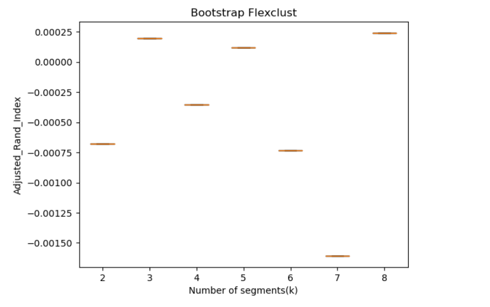

This is another approach to determine good number of segments and it is based on the
Stability data structure analysis.

In the below plot, the vertical boxplots show the distribution of stability for each number of segments. The median is indicated by the fat black horizontal line in the middle of the box. Higher stability is better.Solutions containing a small number of segments typically lack the market insights managers are interested in.
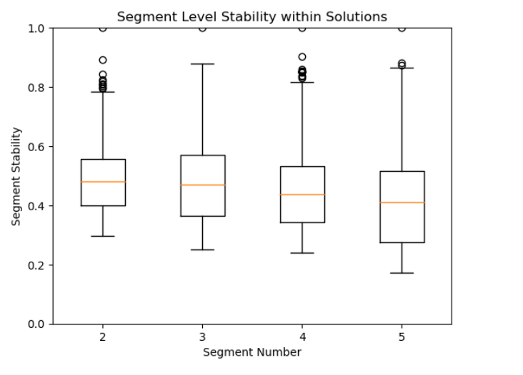

Lets us explore the first 4 segments in breif in the below plot.None of the below segments are well seperated as the similarity level of all of them vary from 0.5 to 1.0.

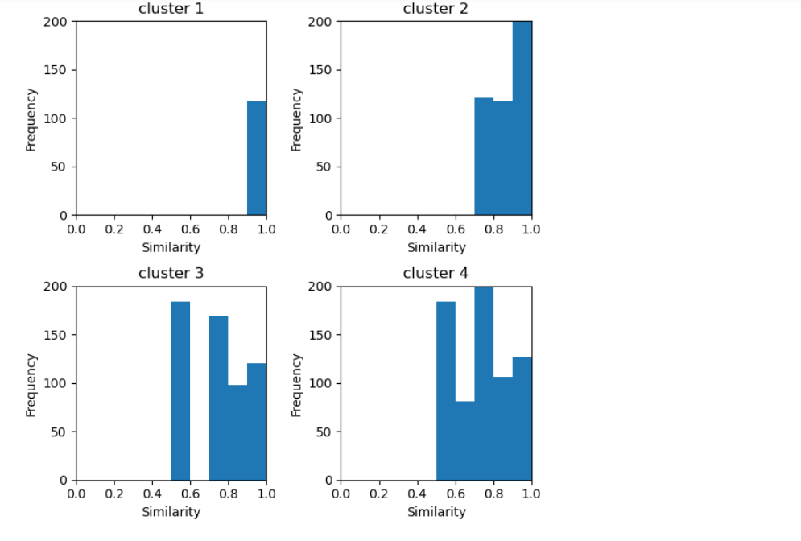

Inorder to inspect how how segment memberships change each time an additional market segment is added, and to assess segment level stability across solutions. This information is contained in the segment level stability across solutions (SLSA) plot and
for the segments from 2-8 the plot is shown below.
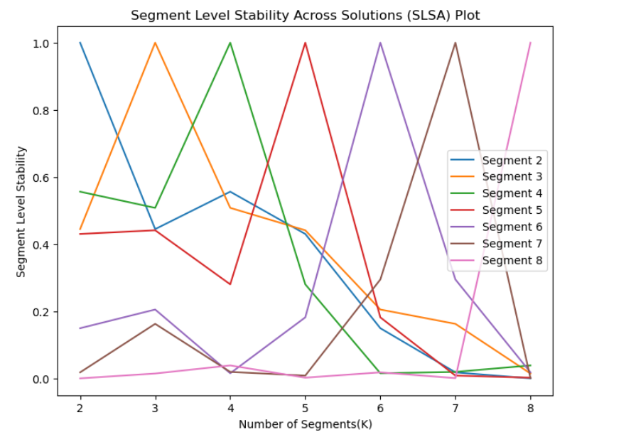

The below plot shows the information criteria values AIC, BIC and ICL on the y-axis
for the different number of components (segments) on the x-axis. As can be seen, the
values of all information criteria decrease quite dramatically until four components
(market segments) are reached. If the information criteria are strictly applied based
on statistical inference theory, the ICL recommends – by a small margin – the
extraction of seven market segments. The BIC also points to seven market segments.
The AIC values continue to decrease beyond seven market segments, indicating that
at least eight components are required to suitably fit the data.
The visual inspection of Fig. A.7 suggests that four market segments might be a
good solution if a more pragmatic point of view is taken; this is the point at which the
decrease in the information criteria flattens visibly. 
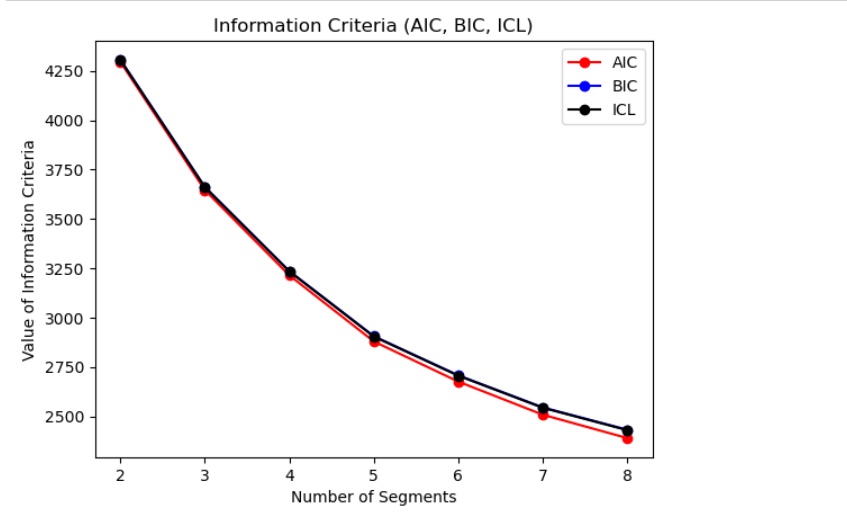

Segment profile plot for the four-segment solution for the fast food data set
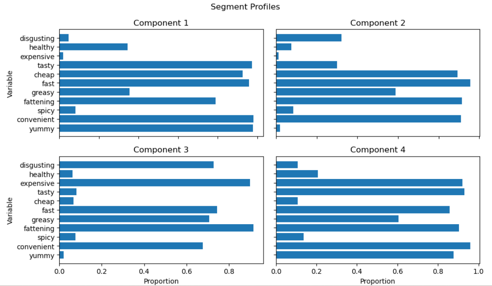

Segment separation plot using principal components 1 and 2 for the fast food data set
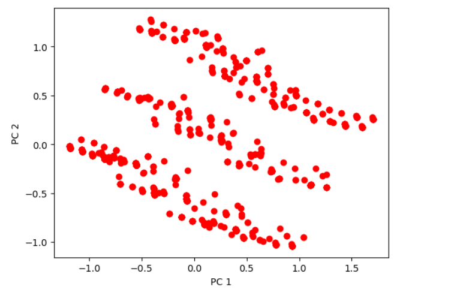
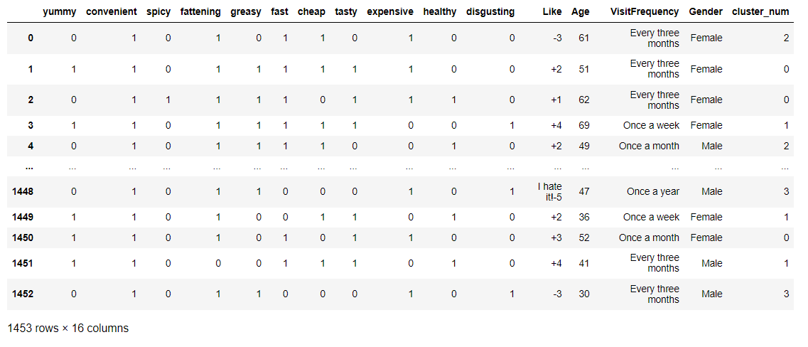
