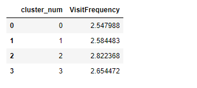
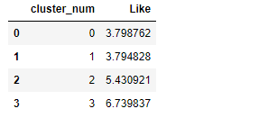

# Market-Segmentation-on-McDonalds
The below shown is the Mc Donalds dataset which has the feedback collected from 1453 cutomers on various factors.

The below shown is the Principal Component Analysis of all the 11 categories and their
corresponding standard deviation,proportion of variance and cummulative proportion. These Principal Component are calculated so that these resulting components can be rotated to project the data for analysis.

Rotate the Principal component what ever were computed earlier.

Now, project the data into the principal component space.The below shown figure is the projection of the two principal components PC1 and PC2
on all the different categories

